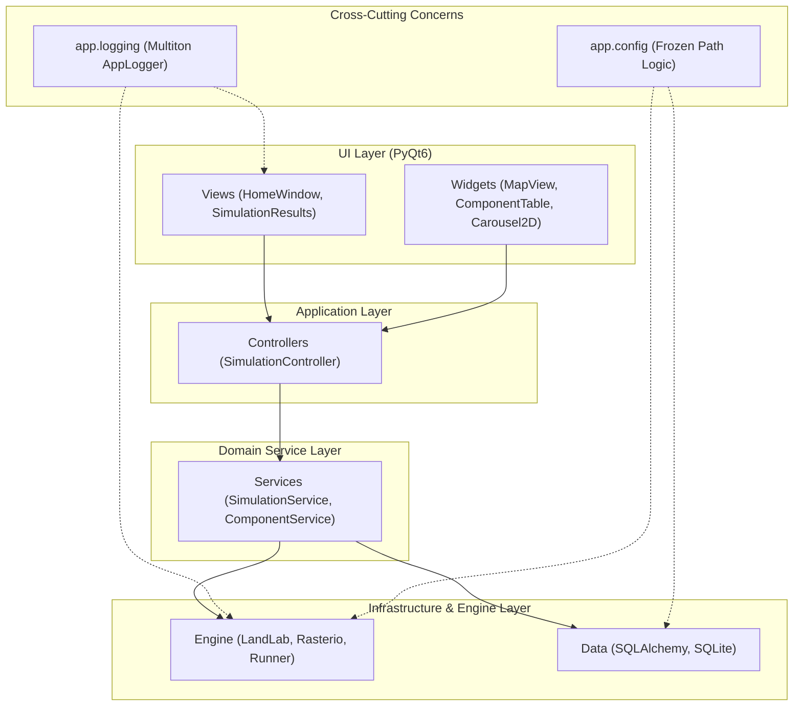

# LandEvolve Architecture Diagram

This document illustrates the technical architecture of LandEvolve.

## Layered System Architecture

## Component Breakdown

### 1. UI Layer
- **Responsibility**: Rendering PyQt6 widgets, handling user input events, and managing local UI state.
- **Rule**: Never imports from `app.engine` or `app.services` directly. All actions pass through a Controller.

### 2. Controller Layer (Facade)
- **Responsibility**: Acts as the boundary between the UI and the backend. Orchestrates the flow of data and commands.
- **Rule**: Stateless or minimal state. Delegates complex tasks to Services.

### 3. Service Layer (Business Logic)
- **Responsibility**: Implements the "meat" of the application logic. Manages transactions, coordinates multiple engine steps, and transforms data for the UI.

### 4. Infrastructure Layer
- **Engine**: The core scientific simulation using LandLab and Rasterio.
- **Data**: Persistence layer using SQLAlchemy to manage the SQLite database.

## Packaging & Path Management

The application handles two distinct runtime environments:

| Feature | Development (Unfrozen) | Executable (Frozen) |
| :--- | :--- | :--- |
| **_BUNDLED_ROOT** | Project Root | Internal `_MEIPASS` folder |
| **BASE_DIR** | Project Root | User Application Directory |
| **Logs & DB** | Root `/logs` & `/app/data/db` | App Folder (beside `.exe`/`.app`) |
| **Resources** | `/resources` | Bundled in `_internal` |

## Logging Flow

The logging system uses a **Multiton** pattern.
1. Decorators (`@log_method`, `@log_action`) detect the calling module.
2. `LogManager` resolves the specific logger instance (`ui`, `engine`, or `backend`).
3. Logs are routed to distinct files in the writable `logs/` directory.
